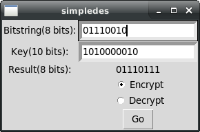

# About:
Simple-des is a simplified DES encryption/decryption example program written in python3. The file simpledes.py contains all of the logic for the encryption/decryption algorithms. simpledesgui.py only contains the code for running the user interface.

# How to use:
Inside this git repository, run these commands:
```
$ ./src/simpledes.py #runs the cli version

$ ./src/simpledesgui.py #runs the GUI version
```


